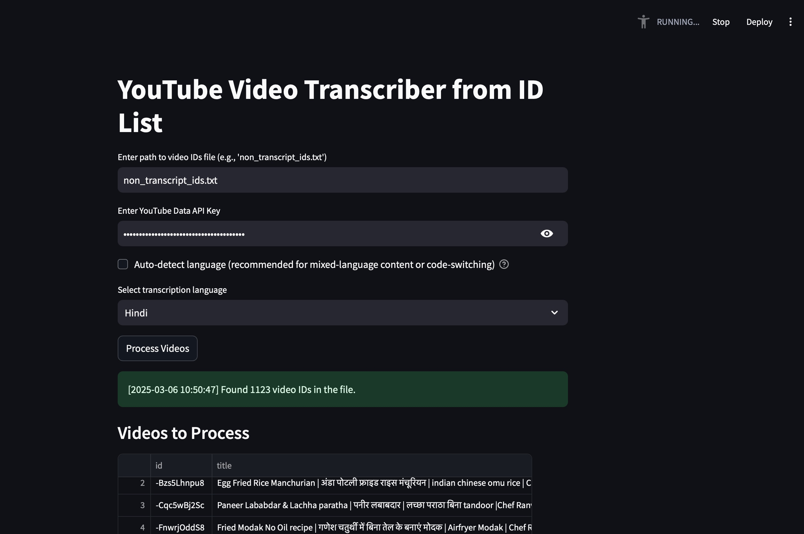
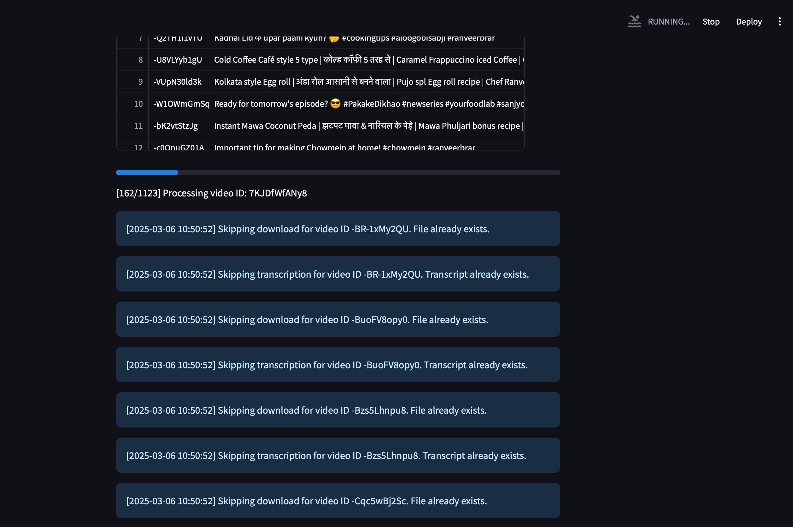

# YouTube Video Transcriber

A Streamlit application for batch transcribing YouTube videos from a list of video IDs, with support for Indian languages.




## Features

- **Batch Processing**: Transcribe multiple YouTube videos from a list of IDs
- **Indian Language Support**: Supports Kannada, Hindi, Tamil, Marathi, Gujarati, Punjabi, and Bengali
- **Language Auto-detection**: Option to let Whisper automatically detect the language
- **YouTube Data Integration**: Fetches video titles and metadata using YouTube API
- **Multiple Output Formats**: 
  - Individual CSV transcripts for each video
  - Combined CSV with all transcripts
  - Multi-sheet Excel file with each video on a separate sheet
- **Skip Existing**: Avoids re-downloading or re-transcribing content that's already processed

## Requirements

- Python 3.7+
- [Streamlit](https://streamlit.io/)
- [Whisper](https://github.com/openai/whisper)
- [yt-dlp](https://github.com/yt-dlp/yt-dlp)
- [Google API Python Client](https://github.com/googleapis/google-api-python-client)
- YouTube Data API Key

## Installation

1. Clone this repository:
   ```bash
   git clone https://github.com/yourusername/yt_video_to_indic.git
   cd yt_video_to_indic
   ```

2. Install the required packages:
   ```bash
   pip install -r requirements.txt
   ```

3. Get a YouTube Data API key:
   - Go to the [Google Cloud Console](https://console.cloud.google.com/)
   - Create a new project
   - Enable the YouTube Data API v3
   - Create credentials (API key)

## Usage

1. Create a text file with YouTube video IDs, one per line:
   ```
   dQw4w9WgXcQ
   9bZkp7q19f0
   ...
   ```

2. Run the Streamlit app:
   ```bash
   streamlit run yt-transcription-from-file-ids2802.py
   ```

3. In the app:
   - Enter the path to your video IDs file
   - Paste your YouTube Data API Key
   - Choose language settings (auto-detect or specific language)
   - Click "Process Videos"

4. The app will:
   - Download audio from each YouTube video
   - Transcribe each audio file
   - Generate individual and combined transcription files
   - Provide download buttons for the resulting files

## File Structure

```
yt_video_to_indic/
├── yt-transcription-from-file-ids2802.py  # Main application
├── audio_files/                           # Directory created for storing audio files
│   ├── VIDEO_ID.mp3                       # Downloaded audio files
│   ├── VIDEO_ID_transcription.csv         # Individual transcription files
│   ├── all_transcripts_multisheet.xlsx    # Excel with all transcriptions
│   └── all_transcripts_combined.csv       # Combined CSV with all transcriptions
└── VIDEO_IDS.txt                          # Your file with YouTube video IDs
```

## Configuration Options

- **Language Selection**: Choose from supported Indian languages or enable auto-detection
- **API Key**: YouTube Data API Key for fetching video metadata
- **Video IDs File**: Path to the file containing YouTube video IDs

## Error Handling

The app includes comprehensive error handling:
- Tracks and reports failed video processing
- Logs timestamps for all operations
- Provides visual feedback on processing status

## License

[MIT License](LICENSE)

## Contributing

Contributions are welcome! Please feel free to submit a Pull Request.
